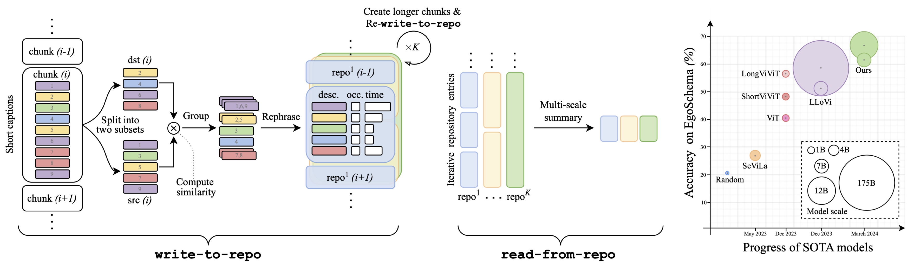

# Language Repository

This is the official implementation for the paper, [Language Repository for Long Video Understanding](https://arxiv.org/abs/2403.14622).

## **Introduction**



Language has become a prominent modality in computer vision with the rise of multi-modal LLMs. Despite supporting long context-lengths, their effectiveness in handling long-term information gradually declines with input length. This becomes critical, especially in applications such as long-form video understanding. In this paper, we introduce a Language Repository (LangRepo) for LLMs, that maintains concise and structured information as an interpretable (i.e., all-textual) representation. Our repository is associated with its read and write operations. The write operation (write-to-repo) prunes redundant text, creating concise descriptions that keep the context-utilization of LLMs in-check. It happens in two stages: by (1) grouping most similar captions based on embedding (eg: CLIP) similarities between two subsets, and (2) rephrasing grouped captions with an LLM-call. The iterative application of write operation with increasingly-longer chunks enables us to learn high-level semantics (eg: long temporal dependencies). The read operation (read-from-repo) extracts such stored language descriptions and any optional metadata within the repository entries (eg: timestamps, #occurances), by summarizing in multiple temporal scales, which is also an LLM-call. Altogether, our proposed framework is applied in zero-shot to long-term video reasoning tasks including visual question-answering (VQA) on EgoSchema, NExT-QA and IntentQA, and visually-grounded VQA on NExT-GQA, showing strong performance at its scale.

## **Installation**

**Set up environment.**

```bash
git clone https://github.com/kkahatapitiya/LangRepo.git
cd LangRepo
conda create -n langrepo python=3.10 -y
conda activate langrepo
pip install openai pandas transformers accelerate sentence-transformers
pip3 install torch torchvision torchaudio --index-url https://download.pytorch.org/whl/cu121
```

**Download pre-extracted captions.**

Download pre-extrated captions provided in LLoVi github repo, using [this drive](https://drive.google.com/file/d/13M10CB5ePPVlycn754_ff3CwnpPtDfJA/view?usp=drive_link). Please refer to the same for the details about how captions are extracted. Unzip the captions in ```./data```.

**Download models.**

Download [Mistral-7B-Instruct-v0.2](https://huggingface.co/mistralai/Mistral-7B-Instruct-v0.2) and [Mixtral-8x7B-Instruct-v0.1](https://huggingface.co/mistralai/Mixtral-8x7B-Instruct-v0.1) model checkpoints, following the instructions on huggingface. Place the checkpoints in ```./hf_ckpt```.

## EgoSchema

**Create repository.**

```bash
python main_repo.py \
--model ./hf_ckpt/Mistral-7B-Instruct-v0.2/ \
--text_encode clip \
--dataset egoschema \
--output_base_path output/egoschema/rep \
--output_filename m7b_rephrase_egoschema.json \
--num_examples_to_run -1 \
--task sum \
--prompt_type rephrase_sum_mistral \
--num_iterations 1 \
--num_chunks [4] \
--merge_ratio 0.25 \
--dst_stride 4 \
--num_words_in_rephrase 20 \
--num_words_in_sum 500 \
--read_scales [-4,-3,-2,-1]
```

**Answer multiple-choice questions.**

```bash
python main_ll_eval.py \
--model ./hf_ckpt/Mistral-7B-Instruct-v0.2/ \
--dataset egoschema \
--output_base_path output/egoschema \
--output_filename m7b_lleval_egoschema.json \
--data_path output/egoschema/rep/m7b_rephrase_egoschema_data.json \
--num_examples_to_run -1 \
--prompt_type qa_ll_mistral
```

## NExT-QA

**Create repository.**

```bash
python main_repo.py \
--model ./hf_ckpt/Mistral-7B-Instruct-v0.2/ \
--text_encode clip \
--dataset nextqa \
--output_base_path output/nextqa/rep \
--output_filename m7b_rephrase_nextqa.json \
--data_path data/nextqa/llava1.5_fps1.json \
--anno_path data/nextqa/val.csv \
--duration_path  data/nextqa/durations.json \
--num_examples_to_run -1 \
--task sum \
--prompt_type rephrase_sum_mistral \
--num_iterations 2 \
--num_chunks [2,2] \
--merge_ratio 0.25 \
--dst_stride 2 \
--num_words_in_rephrase 20 \
--num_words_in_sum 500 \
--read_scales [-2,-1]
```

**Answer multiple-choice questions.**

```bash
python main_ll_eval.py \
--model ./hf_ckpt/Mistral-7B-Instruct-v0.2/ \
--dataset nextqa \
--output_base_path output/nextqa \
--output_filename m7b_lleval_nextqa.json \
--data_path output/nextqa/rep/m7b_rephrase_nextqa_data.json \
--anno_path data/nextqa/val.csv \
--duration_path  data/nextqa/durations.json \
--num_examples_to_run -1 \
--prompt_type qa_ll_mistral_nextqa
```

## IntentQA

**Create repository.**

```bash
python main_repo.py \
--model ./hf_ckpt/Mistral-7B-Instruct-v0.2/ \
--text_encode clip \
--dataset intentqa \
--output_base_path output/intentqa/rep \
--output_filename m7b_rephrase_intentqa.json \
--data_path data/nextqa/llava1.5_fps1.json \
--anno_path data/intentqa/test.csv \
--duration_path  data/nextqa/durations.json \
--num_examples_to_run -1 \
--task sum \
--prompt_type rephrase_sum_mistral \
--num_iterations 1 \
--num_chunks [1] \
--merge_ratio 0.25 \
--dst_stride 4 \
--num_words_in_rephrase 20 \
--num_words_in_sum 500 \
--read_scales [-1]
```

**Answer multiple-choice questions.**

```bash
python main_ll_eval.py \
--model ./hf_ckpt/Mistral-7B-Instruct-v0.2/ \
--dataset intentqa \
--output_base_path output/intentqa \
--output_filename m7b_lleval_intentqa.json \
--data_path output/intentqa/rep/m7b_rephrase_intentqa_data.json \
--anno_path data/intentqa/test.csv \
--duration_path  data/nextqa/durations.json \
--num_examples_to_run -1 \
--prompt_type qa_ll_mistral_nextqa
```

## NExT-GQA

**Create repository.**

```bash
python main_repo.py \
--model ./hf_ckpt/Mistral-7B-Instruct-v0.2/ \
--text_encode clip \
--dataset nextgqa \
--output_base_path output/nextgqa/rep \
--output_filename m7b_rephrase_nextgqa.json \
--data_path data/nextqa/llava1.5_fps1.json \
--anno_path data/nextgqa/test.csv \
--duration_path  data/nextqa/durations.json \
--num_examples_to_run -1 \
--task sum \
--prompt_type rephrase_sum_mistral \
--num_iterations 2 \
--num_chunks [2,1] \
--merge_ratio 0.25 \
--dst_stride 2 \
--num_words_in_rephrase 20 \
--num_words_in_sum 250 \
--read_scales [-3,-2,-1]
```

**Answer multiple-choice questions.**

```bash
python main_ll_eval.py \
--model ./hf_ckpt/Mistral-7B-Instruct-v0.2/ \
--dataset nextgqa \
--output_base_path output/nextgqa \
--output_filename m7b_lleval_nextgqa.json \
--data_path output/nextgqa/rep/m7b_rephrase_nextgqa_data.json \
--anno_path data/nextgqa/test.csv \
--duration_path  data/nextqa/durations.json \
--num_examples_to_run -1 \
--prompt_type qa_ll_mistral_nextqa
```

**Ground answers in time.**

```bash
python main.py \
--model ./hf_ckpt/Mistral-7B-Instruct-v0.2/ \
--dataset nextgqa \
--output_base_path output/nextgqa \
--output_filename m7b_grounding_nextgqa.json \
--data_path data/nextqa/llava1.5_fps1.json \
--anno_path data/nextgqa/test.csv \
--duration_path  data/nextqa/durations.json \
--nextgqa_gt_ground_path data/nextgqa/gsub_test.json \
--nextgqa_pred_qa_path output/nextgqa/m7b_lleval_nextgqa.json \
--num_examples_to_run -1 \
--task gqa \
--prompt_type gqa_mistral
```

## Citation

If you find this useful, please consider citing our work:

```
@misc{Kahatapitiya2024langrepo,
      title={Language Repository for Long Video Understanding}, 
      author={Kahatapitiya, Kumara and Ranasinghe, Kanchana and Park, Jongwoo and Ryoo, Michael S},
      year={2024},
      eprint={2403.14622},
      archivePrefix={arXiv},
      primaryClass={cs.CV}
}
```

## Acknowledgement

This implementation is based on [LLoVi](https://github.com/CeeZh/LLoVi) and [tomesd](https://github.com/dbolya/tomesd). I would like to thank the original authors for their inspiring work and open-source implementations.
